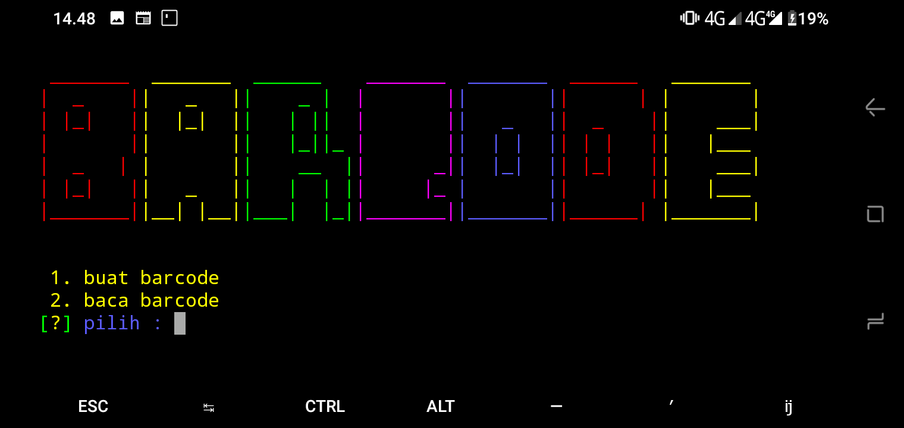

<h1> Qr Reader <h1><br>
<h3>Installansi<h3>
```
$ apt update
$ apt upgrade
$ pkg install git -y
$ git clone https://github.com/krypton-byte/barcode
$ cd barcode
$ pkg install pyzbar
$ pkg install python -y
$ python3 -m pip install pyqrcode
$ python3 -m pip install -r requirements.txt
$ python barcode.py
```
<br><h3>Screenshot</h3><br>

